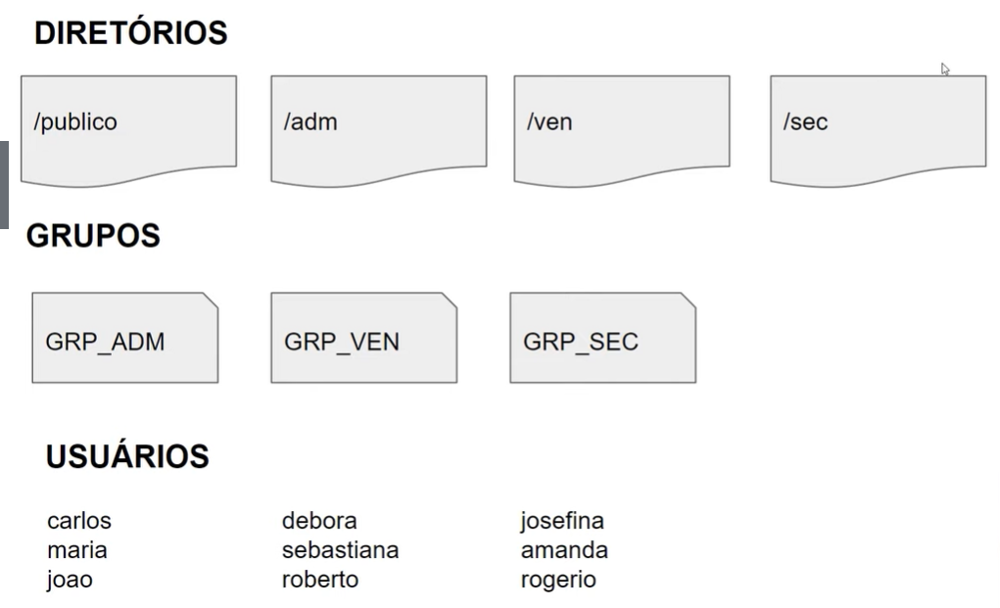

# Projeto Infraestrutura como código - Bootcamp Linux Experience

## Script de criação de estrutura de usuários, diretórios e permissões

Infraestrutura como código (IaC) é o gerenciamento e provisionamento da infraestrutura por meio de código, em vez de processos manuais.
Nesse projeto foi criado um arquivo de configuração que inclui as especificações de uma infraestrutura, facilitando edição e distribuição de configurações, assegurando assim o provisionamento do mesmo ambiente todas as vezes.

### Estrutura exemplo

